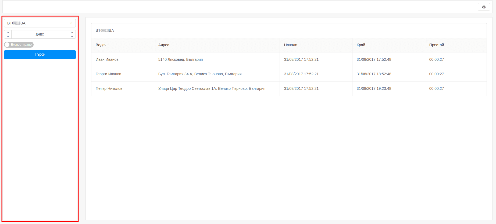
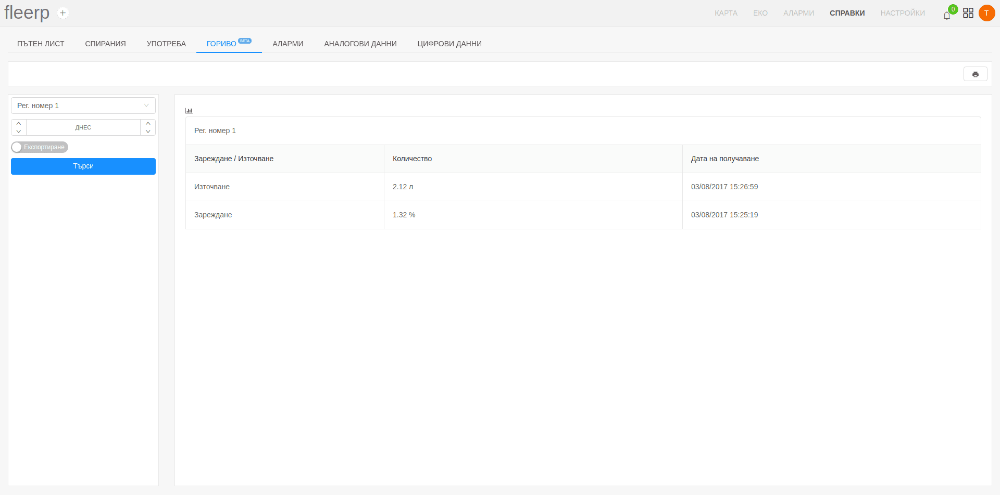
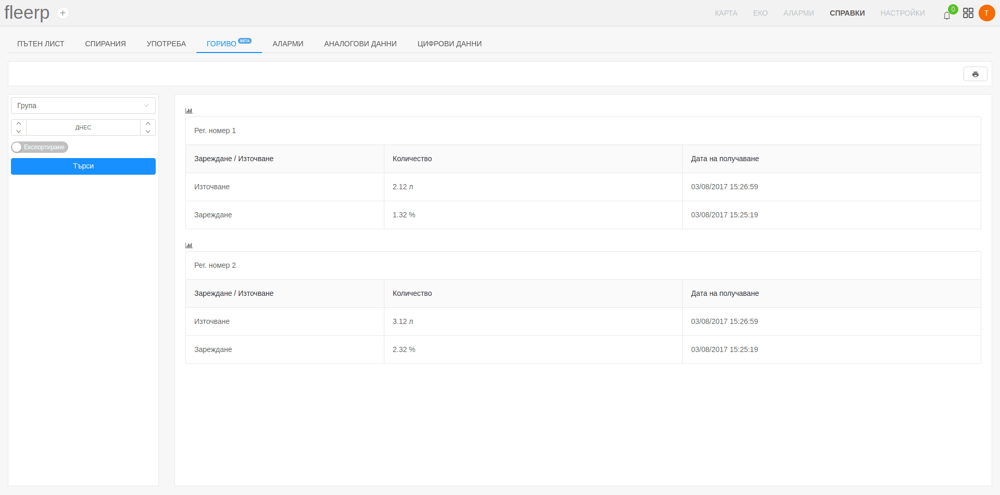
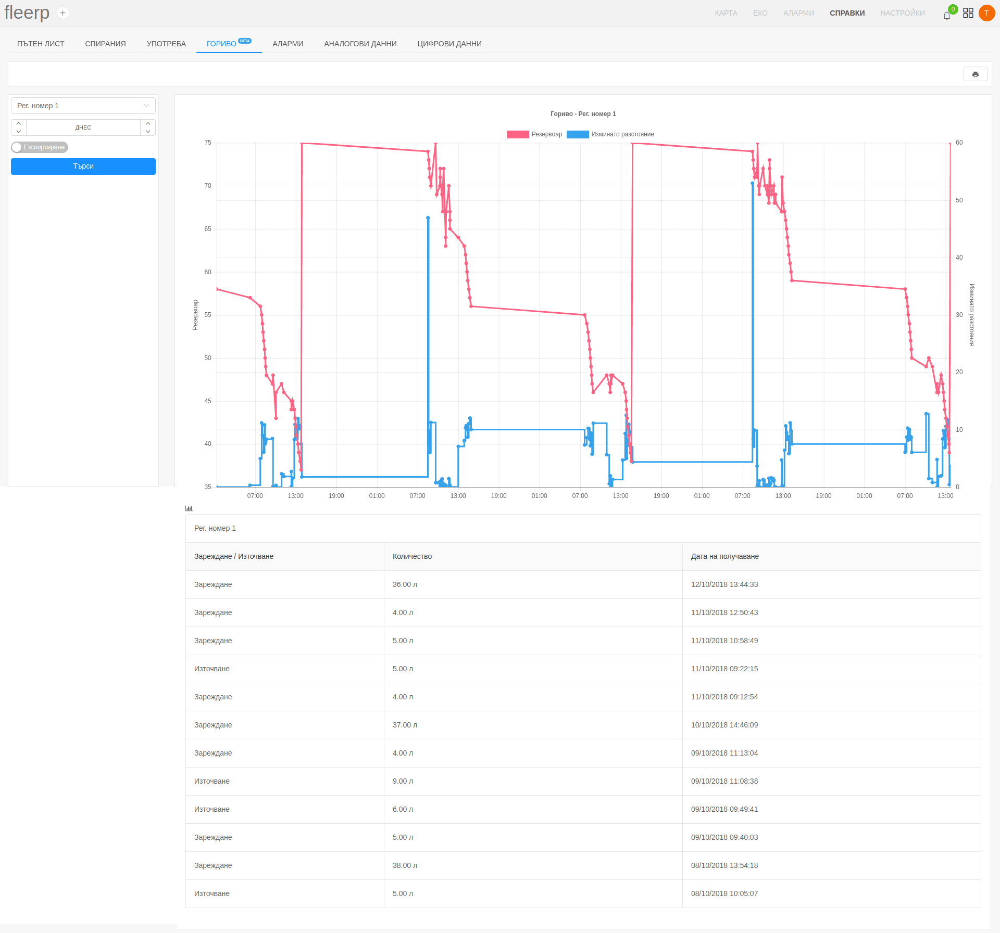
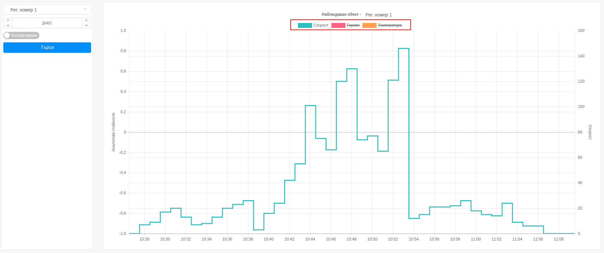
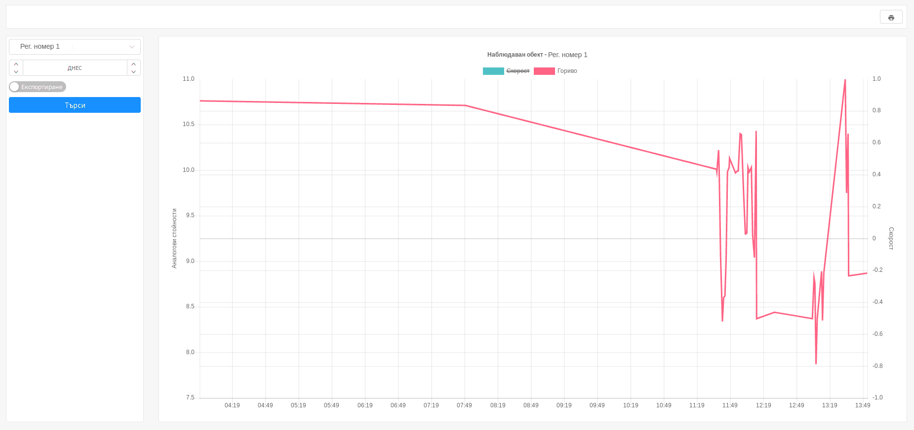
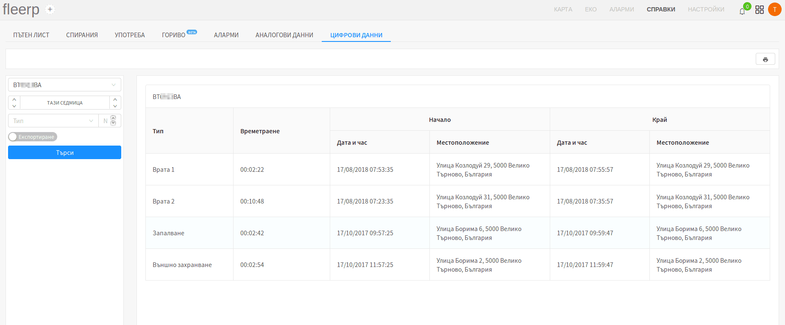
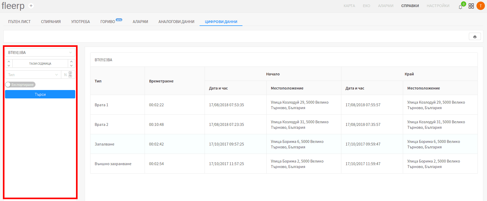
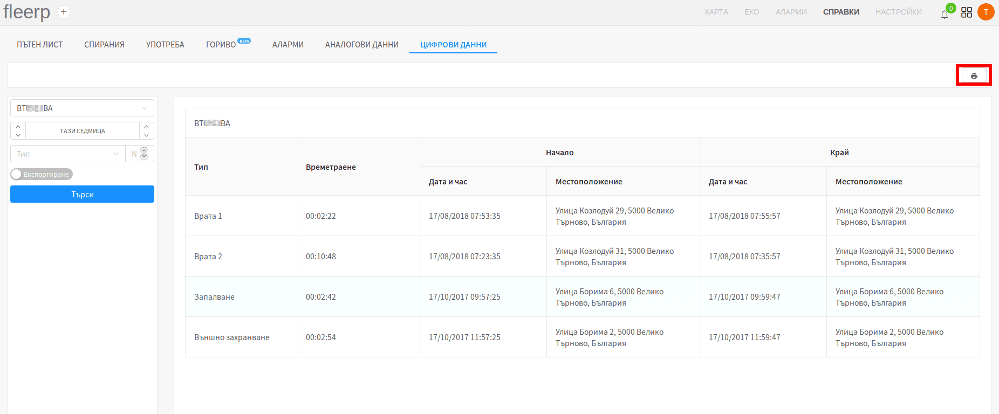

# Справки

Подобряване качеството на работа и оптимизирането на разходи
са едни от основните цели на правилно развиващите се организации.
Справките са едни от най-важните инструменти за постигането на тези цели.

В системата Fleerp са интегрирани следните типове справки.

- Пътен лист;
- Спирания;
- Употреба;
- Гориво;
- Аларми;
- Аналогови данни;
- Цифрови данни;

Началният екран е разделен на два компонента:

- страничен панел;
- обобщен екран;

## Страничен панел

Страничният панел служи за:

- избор на определен период от време, за който да бъде генерирана справка.
- селектиране на конкретен проследяващ обект или група.
- експортиране - генерираната справка се експортира в Excel файл. 

---

## Основен екран

Основният екран визуализира данни, които са събрани от проследяваните обекти за избраната времева рамка.

---

Също така е предоставен бутон за принтиране на дадена справка.

# Пътен лист

Пътният лист предоставя подробна информация за движението на проследяваните обекти.
На разположение са два вида пътни листи:

- опростени пътени листи;
- подробни пътени листи;

## Опростен пътен лист

Генерирането му се извършва от страничния панел с избор на: 

- конкретен обект или група; 
- определен период от време;  

Справката съдържа следната информация:

- **дата** - дата за която се отнася генерираната справка;
- **в движение** - общото време в което проследявания обект е бил в движение; 
- **престой** - общото време в което проследявания обект е бил в покой;
- **пробег** - разстоянието което е изминато;
- **километраж** 
  - **начален** - показанията на километража в началото на периода;
  - **краен** - показанията на километража в края на периода;
  

---

## Подробен пътен лист

Подробният пътен лист дава пълна инфорамация за всяко спиране и потегляне, къде и кога то се е случило
и още много подробна и полезна информация.

Генерирането му се извършва от страничния панел с избор на: 

- конкретен обект или група; 
- определен период от време; 
- кликване на бутон "Подробености" 

Справката съдържа следната информация:

- **водач** - името на водача;
- **начало**;
  - километража при потегляне; 
  - дата и час на потегляне;
  - адрес на потегляне;
- **движение**;
  - **време** - времето в което се е движил проследяваният обект;
  - **пробег** - разстоянието което е изминато;
- **край**;
  - километража при спиране; 
  - дата и час на спиране;
  - адрес на спиране;
- **престой** - времето от спирането до потеглянето на проследявания обект;

# Спирания

Справката за спирания предоставя подробна информация, за това къде, кога и за какъв период от време е спирано.

Генерирането на справката се извършва от страничния панел с избор на:

- конкретен обект или група;
- определен период от време;

Справката съдържа следната информация:

- **водач** - името на водача;
- **адрес** - адрес на престоя;
- **начало** - начало на престоя;
- **край** - край на престоя;
- **престой** - общото време в което проследявания обект е бил в покой;

# Употреба

Справката за употреба дава детайлна информация за това, кога проследяваният обект е бил в движение.
Тази справка генерира информация, която зависи от зададеното работно време на компанията
*[линк](../../web/settings/general)*.

Генерирането на справката се извършва от страничния панел с избор на:

- конкретен обект или група;
- определен период от време;

Справката съдържа следната информация:

- **дата** - дата за която се отнася генерираната справка;
- **в работно време**;
  - **пробег** - разстоянието което е изминато;
  - **продължителност** - времето в което се е движело проследяваното устройство;
- **извън работно време**;
  - **пробег** - разстоянието което е изминато;
  - **продължителност** - времето в което се е движело проследяваното устройство;

# Гориво

Справката за гориво предоставя информация относно наличието на гориво за даден проследяван обект и е налична само
когато е инсталиран датчик за измерване на гориво.

Чрез установяването на резки промени в нивото на горивото, би могло да се твърди че се извършва една от дейностите:
- източване на гориво;
- зареждане на гориво;

Предоставената справка съдържа следната информация:
- описание на извършеното действие - зареждане или източване на гориво;
- количество измерено гориво;
- времето когато е извършено действието;
 
Справката може да бъде генерирана, както за един обект, така и за цяла група.

Добавена е допълнителна визуализация във вид на графика, достъпна от бутона.

Възможно е скриване/показване на данни от графиката след клик върху даден етикет.

 

При посочване с мишката върху точка от графиката се визуализира прозорец с информация за дадения момент.

**Важно:** функционалноста се намира в етап на бета разработка и е възможна поява на некоретни данни, поради неправилно отчетени от датчика стойности.

# Аларми

Справката за аларми предоставя информация за всички възникнали аларми за даден проследяващ обект или група от обекти, в
рамките на даден период.

Предоставената справка визуализира следната информация:
- име на алармата;
- тип на алармата;
- продължителност на алармата;
- начало на алармата;
- край на алармата;
- допълнителна информация;

Ако потребителят посочи тип на аларма, при търсенето ще се визуализират само алармите от зададения тип. В противен случай
ще бъдат визуализирани всички възникнали аларми.

# Аналогови данни

Аналоговите данни предоставят визуална информация за състоянието на аналоговите портове чрез графика.
Справката за аналогови данни се генерира за конкретен проследяван обект.
В текущия пример се визуализират данни за скоростта, температурата и горивото на обекта.

Генерирането на справката се извършва от страничния панел с избор на:

- конкретен обект;
- определен период от време;

Справката съдържа данни за аналоговите портове, които са конфигурирани за дадения обект. За конкретния пример са:

- **Скорост** - визуализира графично промените в скоростта;
- **Гориво** - визуализира графично наличието на гориво;
- **Температура** - визуализира графично каква е външната температура;

За по-детайлна информация, с плъзгане на мишката по графиката се визуализират данните от аналоговите портове
за всеки един момент от справката.

Визуализирането на данни от различни аналогови портове може да бъде скривано и показвано с един клик върху даден етикет. 

---

### Важно:

Възможни са шумове в аналоговите данни, които се получават от проследявания обект. Този проблем се решава
лесно при конфигурирането на даден порт. В настройките на всеки порт има бутон "Шумове" и когато той е активиран
графиката се изглажда *[линк](../../web/settings/tobjects/details/ports/analogs)*.

# Цифрови данни

Цифровите данни предоставят възможност на потребителя, да генерира подробна справка относно конфигурираните
цифрови портове на даден проследяван обект или група от проследявани обекти.

---

Екранът е разделен на два компонента:

- страничен панел;
- основен екран;

## Страничен панел

---

Страничният панел се състои от:

- поле за избор на проследяван обект или група от такива;
- поле за избор на времева рамка, за която да бъде генерирана справката;
- поле за избор на тип порт, за който да бъде генерирана справката;
- бутон за експортиране на справката в Excel файл;

#### Важно:

Ако полето за избор на тип порт е оставено празно, ще бъде генерирана справка за всички цифрови портове,
които са конфигурирани за дадения проследяван обект. 

Полето за избор на тип порт предоставя възможност за индексиране на типа. Тази функционалност позволява
генериране на справки за повтарящ се тип порт, като: врата-1, врата-2 и т.н.

## Основен екран

---

Основният екран се състои от няколко полета:

- **тип** - типът на дадения порт;
- **времетраене** - сумарното време, за което портът е бил активен;
- **начало** - дата и час, както и местоположение (адрес) на активирането на даден порт;
- **край** - дата и час, както и местоположение (адрес) на деактивирането на даден порт;

Системата предоставя възможност и за принтиране на генерираната справка, чрез предвидения за това бутон:

